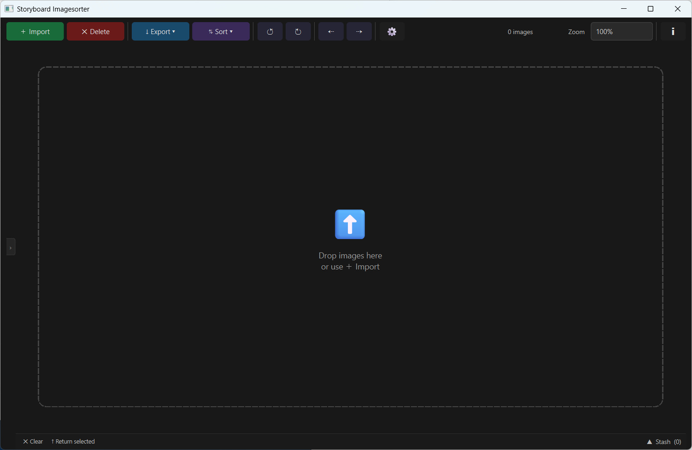
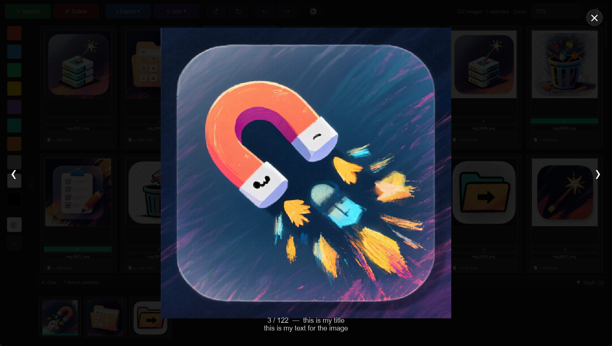
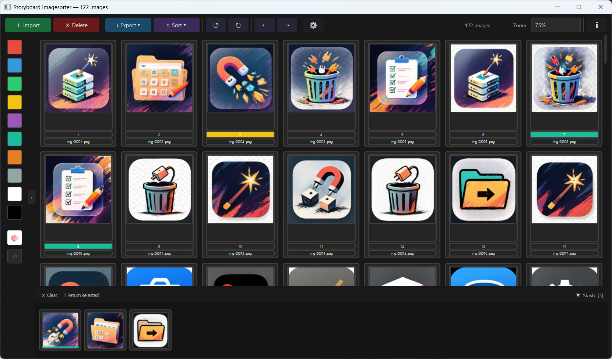
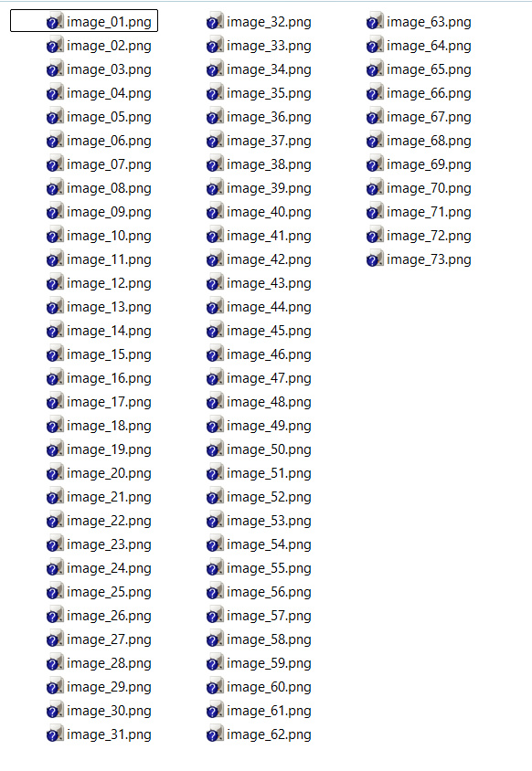

***

# Storyboard Imagesorter 🖼️

**Organize your storyboard frames and image sequences quickly and visually.**

Storyboard Imagesorter is a lightweight, intuitive tool designed for artists, animators, and previs professionals. It allows you to take image files and turn them into an organized sequence with color tags, text notes, and export layouts.

---

## 📸 Preview

| Main Workspace | Lightbox View |
| :---: | :---: |
|  |  |

| Contact Sheet (Grid) | Storyboard List (Layout) |
| :---: | :---: |
|  |  |

---

## 🚀 User Guide (Workflow)

### 1. Import your images
* **Drag & Drop:** Select image files from your file explorer and drag them directly into the window, or click the **"＋ Import"** button.
* **Auto-Magic Import:** If you import images from a folder that already contains a `_sorter_data.txt` file, the tool will **automatically** detect it and restore all your colors and notes for those images instantly.

### 2. Organize your sequence
* **Reorder:** Click and drag any image to move it to a new position.
* **Move Groups:** Use the arrow buttons in the top toolbar to shift selected groups of images left or right.
* **The Stash:** If you have images that don't belong in your current sequence, drag them into the **Stash Zone** at the bottom. They are "parked" there and can be brought back later without being deleted.

### 3. Add details (Notes & Colors)
* **Color Tagging:** Use the sidebar on the left to quickly tap a color onto your selected images (e.g., Blue for "Close-up", Red for "Action").
* **Writing Notes:** Click the **"📝 + Add Note"** button on any image card to type in descriptions, camera angles, or timing info.

### 4. Edit and see changes live
Need to fix a drawing? Double-click an image to open it in your preferred editor (like Photoshop or Krita). Once you hit **Save** in that program, the thumbnail in the Imagesorter updates automatically via our live file watcher.

### 5. Export and "Save" your project
* **To get your final files:** Use the **"↓ Export"** menu. You can create a clean, numbered image sequence, or professional layouts like **Contact Sheets** (for quick review) or **Storyboard Lists** (to see your notes alongside the art).
* **⚠️ IMPORTANT - Image Sequence Export:** When exporting an image sequence, the tool creates **copies** of your images in a new folder with sequential names (e.g., `prefix_01.png`). Your original source files remain completely untouched and unchanged in their original location.
* **⚠️ IMPORTANT - Saving your progress:** When you export, the tool creates a small file called `_sorter_data.txt`. **This is your project's "brain".** It contains all your colors and text notes. 
    * Keep this file safe! 
    * To reload your work later, simply **drag and drop the `_sorter_data.txt` file directly into the application window**. All your annotations will be restored instantly.

---

## ⌨️ Keyboard Shortcuts

### Main View
| Shortcut | Action |
| :--- | :--- |
| `Space` | Open/Close Full-screen Lightbox |
| `Ctrl + Z` / `Ctrl + Y` | Undo / Redo last action |
| `Ctrl + A` / `Ctrl + D` | Select All / Deselect All |
| `Delete` | Remove selected images from the sequence |
| `Tab` | Hide/Show the Stash at the bottom |
| `B` | Hide/Show the Color Sidebar |
| `←` / `→` (Arrows) | Move selected images left or right in sequence |
| `Plus / Minus` | Zoom in and out of the canvas |
| `Scroll` | **Scroll** through large sequences |
| `Shift + Scroll` | **Fast scroll** through large sequences |

### Lightbox Mode (Full-screen)
| Shortcut | Action |
| :--- | :--- |
| `Esc` / `Space` | Close Lightbox |
| `←` / `Up Arrow` | Previous image |
| `→` / `Down Arrow` | Next image |

---

## 🛠️ Technical Specifications

For developers and technical users:

* **Core Stack:** Python 3.10+ and PyQt6.
* **Architecture:** 
    * Implements the **Command Pattern** for a robust Undo/Redo system across all manipulations (sorting, tagging, moving, deleting).
    * Uses a custom **Flow Layout** engine for dynamic image arrangement.
    * Features a background **File Watcher** service to monitor file system changes for real-time thumbnail synchronization.
* **Data Management:** Metadata (colors/notes) is handled via a lightweight text-based exchange format (`_sorter_data.txt`), allowing for easy project reloading without proprietary database overhead.

---

## ⚙️ Installation & Execution

### Windows
The application is provided as a standalone executable.
1. Download the `storyboard_imagesorter.exe` from the [Releases](#) page.
2. Run the `.exe` directly.

### macOS & Linux (Source Distribution)
For macOS and Linux, it is recommended to run via a Python virtual environment.

1. **Clone this repository:**
   ```bash
   git clone https://github.com/yourusername/storyboard-imagesorter.git
   cd storyboard-imagesorter
   ```

2. **Set up a Virtual Environment (Recommended):**
   ```bash
   # Linux / macOS
   python3 -m venv venv
   source venv/bin/activate
   ```

3. **Install Dependencies:**
   ```bash
   pip install -r requirements.txt
   ```

4. **Run the Application:**
   ```bash
   cd storyboard_imagesorter
   python storyboard_imagesorter.py
   ```

---

**License:** GNU General Public License v3.0

**Feedback and Pull Requests are welcome!**

Copyright © 2026 with ❤️ by Reiner Prokein (Haizy Tiles) 